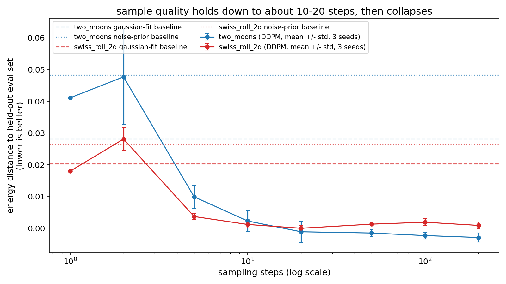

# tiny-diffusion

> ddpm from scratch in numpy, no pytorch, measuring how far sampling steps can be cut

## claim

a from-scratch ddpm's reverse denoising process recovers a target 2d distribution, and
sample quality degrades predictably, with a findable knee, as the number of reverse
(denoising) steps used at sampling time is cut.

## baselines

1. **noise prior**: samples drawn directly from n(0, i), no diffusion at all.
2. **gaussian fit**: mean/covariance of the target distribution, sampled from that
   gaussian. the cheapest distribution-shaped guess that requires no diffusion
   machinery.

the trained model has to beat both baselines, and specifically has to beat (2) at full
sampling steps, for the "the reverse process recovers the target distribution" half of
the claim to hold.

## result

quality is measured as energy distance between generated samples and a held-out eval
set (lower is better). averaged over 3 training seeds (`results/rigor.log`):

| dataset | full steps (200) | gaussian-fit baseline | noise-prior baseline |
|---|---|---|---|
| two_moons | -0.0029 +/- 0.0014 | 0.0282 | 0.0483 |
| swiss_roll_2d | 0.0009 +/- 0.0010 | 0.0203 | 0.0265 |

the trained model beats the gaussian-fit baseline at full steps in all 3 seeds, on both
datasets (`results/rigor.log`, `sanity: beats gaussian_fit in 3/3 seeds`).

**a knee was found.** quality is flat, within noise of the full-step number, down to
about 10-20 steps, then falls off sharply:

| steps | two_moons mean +/- std | swiss_roll_2d mean +/- std |
|---|---|---|
| 200 | -0.0029 +/- 0.0014 | 0.0009 +/- 0.0010 |
| 20 | -0.0011 +/- 0.0033 | 0.0000 +/- 0.0009 |
| 10 | 0.0023 +/- 0.0033 | 0.0012 +/- 0.0011 |
| 5 | 0.0099 +/- 0.0037 | 0.0037 +/- 0.0010 |
| 2 | 0.0477 +/- 0.0151 | 0.0281 +/- 0.0036 |
| 1 | 0.0411 +/- 0.0000 | 0.0180 +/- 0.0001 |

(full 8-step-count table in `results/rigor.log`, single-seed version in `results/run.log`)

at 2 steps the model is roughly as bad as sampling straight from the noise prior:
0.0477 versus a noise-prior baseline of 0.0483 (two_moons), 0.0281 versus 0.0265
(swiss_roll_2d): two reverse steps buys almost nothing over n(0, i). see
`results/FINDING.md` for the short version.

one step scores better than two on both targets (0.0411 versus 0.0477 on two_moons,
0.0180 versus 0.0281 on swiss_roll_2d). both sit at or above the noise-prior floor, so
this is a comparison between two ways of failing rather than evidence that fewer steps
help. the single-hop sampler adds no intermediate noise, which plausibly explains why it
lands marginally closer, but this project did not test that.



## data

two 2d synthetic targets from `sklearn.datasets` (`make_moons`, `make_swiss_roll`
projected to 2d), generated locally, no download, no network, no auth. a tiny image
set (`sklearn.datasets.load_digits`, bundled with scikit-learn) is loaded and
shape-tested (`tests/test_data.py`) as a stretch target but was not used in the headline
2d experiment: training a diffusion model on 8x8 images was out of scope for the
10-minute cpu budget this project set for itself.

## method

ddpm forward process (closed-form `q(x_t | x_0)`) and reverse denoiser (a small mlp
predicting noise) implemented directly in numpy: forward pass, loss, and backward pass
all hand-written, no autodiff framework and no pytorch. a respaced ancestral sampler
draws with any subset of the trained timesteps, which is what makes the step-count sweep
possible. chosen to keep every line readable and to guarantee the whole pipeline trains
in well under 10 minutes on cpu: full training + a full step-count sweep for one dataset
takes under 5 seconds (`results/run.log`).

## reproduce

```bash
pip install -r requirements.txt

python -m src.baselines           # baselines, writes results/baseline.log
python -m src.experiment          # single-seed train + step-count sweep, writes results/run.log
python -m src.rigor               # 3-seed train + sweep, writes results/rigor.log
python -m src.plot_headline       # regenerates results/headline.png from results/rigor.log
pytest tests/
```

total wall-clock time for `src.rigor` (3 seeds x 2 datasets, full training + 8-step-count
sweep each): 51.03s (`results/rigor.log`).

## tests

`pytest tests/`: 13 tests covering data loader shapes/ranges/determinism, and the core claim
(full-step energy distance reliably beats very-few-step energy distance, across seeds),
parsed from the committed `results/rigor.log`.
